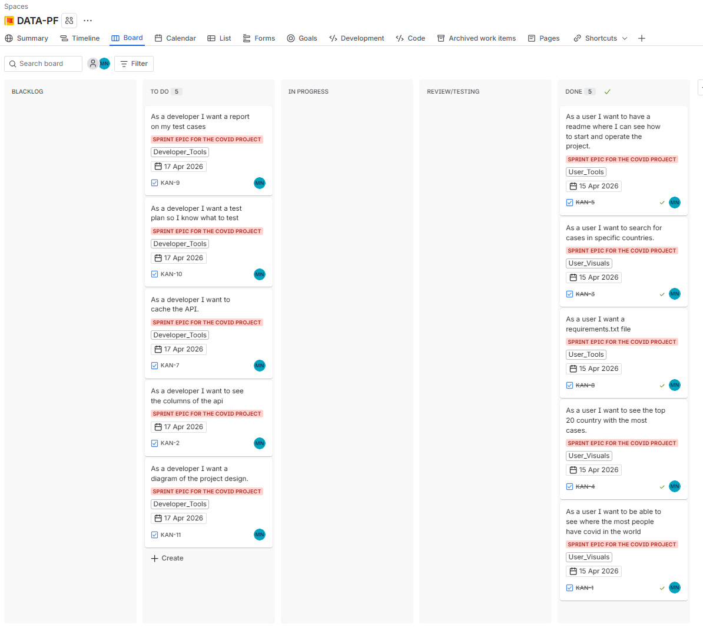

# Opdracht 1.3

- ## Sprint 1
- 

- ## onderbouwing sprint 1
Sprint 1 richtte zich op het verzamelen van data en het voorbereiden van de omgeving. 
We hebben de benodigde libraries geïnstalleerd, een virtuele omgeving opgezet, 
en de eerste stappen gezet in het schrijven van code om data te downloaden en te verwerken.
We hebben ook de structuur van het project opgezet, 
inclusief het organiseren van bestanden en het plannen van de volgende stappen in de backlog.
- ## sprint 2
- 

- ## onderbouwing sprint 2
  - In sprint 2 hebben we ons gericht op het analyseren van de verzamelde data en het creëren van visualisaties.
  We hebben de data opgeschoond en voorbereid voor analyse,
  statistieken per land geaggregeerd, en choropleth-kaarten gemaakt om de verspreiding van cases over landen te tonen.
  Daarnaast hebben we gestapelde staafdiagrammen gemaakt om de verhouding tussen bevestigde cases, 
  - sterfgevallen en herstelgevallen per land te vergelijken.
  