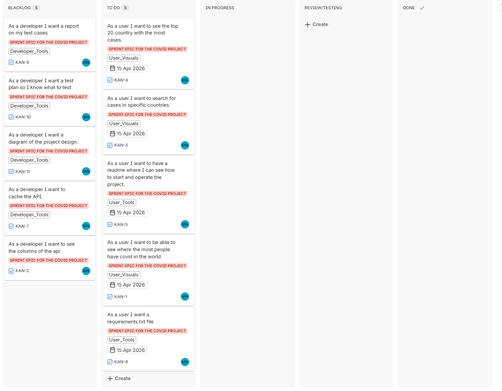

# COVID-19 Data Analysis Project

## Projectbeschrijving

### Wat?
Dit project visualiseert COVID-19 gegevens op kaarten en in grafieken per land. Het verzamelt real-time data van publieke bronnen en maakt deze inzichtelijk voor analyse.

### Hoe?
1. **Data verzamelen** - Haalt COVID-19 statistieken op uit de ArcGIS dataset
2. **Data verwerken** - Schoonmaken en aggregeren van gegevens per land
3. **Visualiseren** - Creëert wereldkaarten en staafdiagrammen

### Waarom?
- **Inzicht geven** - Maakt het makkelijk om de verspreiding van COVID-19 wereldwijd te begrijpen
- **Snel overzicht** - Via kaarten kun je direct zien welke landen het hardst getroffen zijn
- **Vergelijken** - Staafdiagrammen tonen de verhouding tussen bevestigde cases, sterfgevallen en herstelgevallen per land
- **Leren** - Het project toont hoe je data uit API's haalt, verwerkt en visualiseert met Python

## Technieken gebruikt
- **Python** - Programmertaal voor data verwerking
- **Pandas** - Data manipulatie en analyse
- **plotly** - Geografische data en kaarten
- **Matplotlib** - Visualisaties maken
- **Jupyter** - Interactieve notebooks voor analyse

## backlog
- Screenshot met de eerste sprint erbij.
- 
